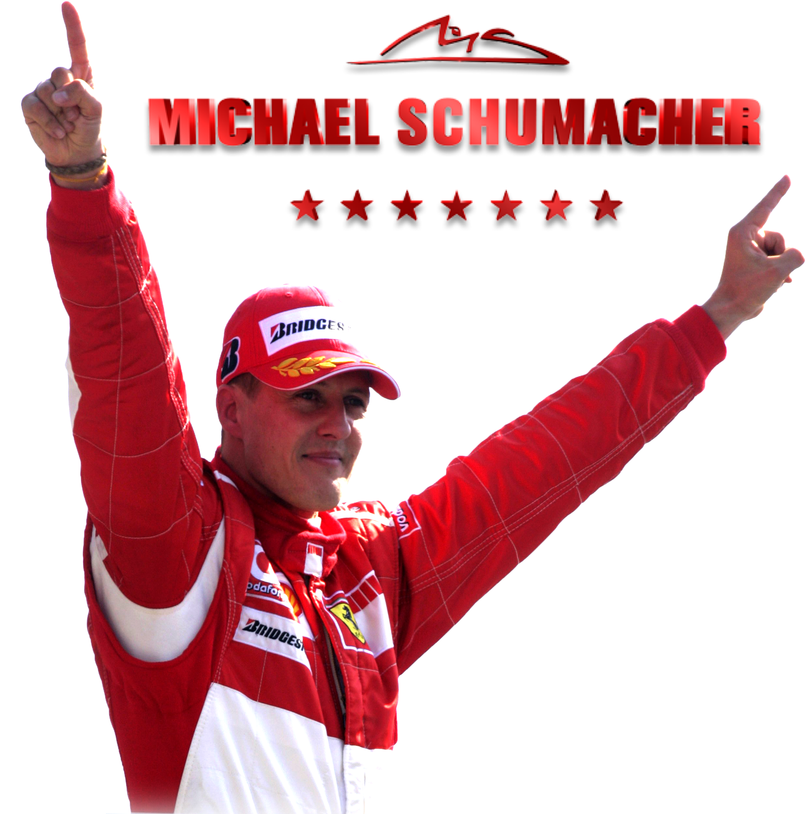
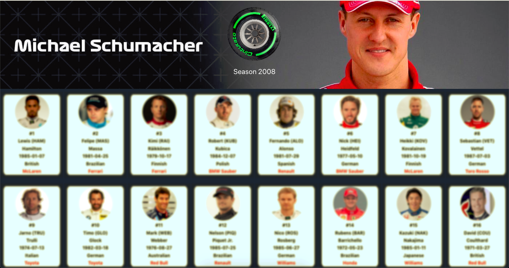
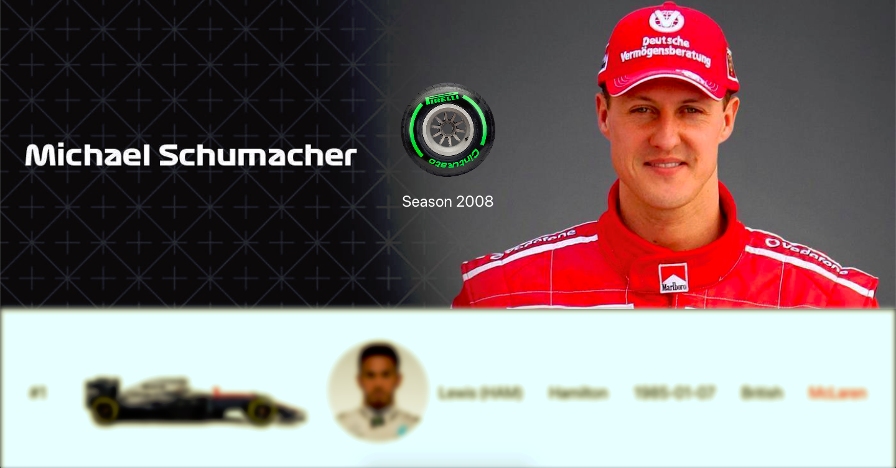

## Formula 1 - The Legend Schumacher API

<b>Michael Schumacher</b> born 3 January 1969) is a retired German racing driver who raced in Formula One for Jordan Grand Prix, Benetton and Ferrari, where he spent most of his career, as well as for Mercedes upon his return to the sport. Widely regarded as one of the greatest Formula One drivers ever and regarded by some as the greatest of all time. 

Schumacher is the only driver in history to win seven Formula One World Championships, five of which he won consecutively. The most successful driver in the history of the sport, Schumacher holds the records for the most World Championship titles, the most Grand Prix wins (91), the most fastest laps (77) and the most races won in a single season (13), and according to the official Formula One website (Formula1.com). 

Schumacher was "statistically the greatest driver the sport has ever seen" at the time of his retirement from the sport. He was also noted throughout his career for pushing his car to the very limit for sustained periods and a pioneering fitness regime.

